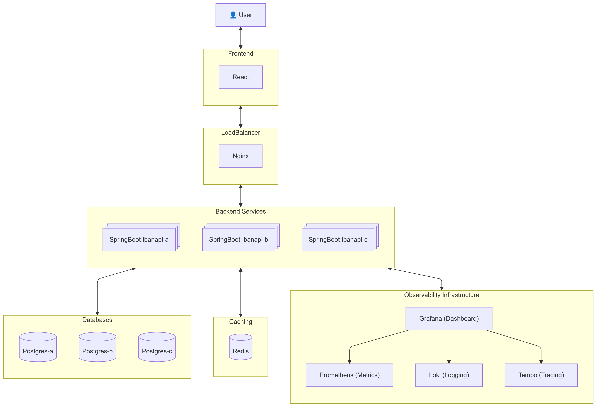
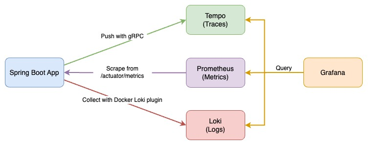

# IBAN Checker

This project is a microservices-based application for validating IBANs, using Frontend React js and Backend Spring boot and database postgresql and caching using redis
with observability features integrated using Prometheus, Grafana, Loki, and Tempo.

## System Design



## Installation & Usage

1. Install Docker

   Follow the instructions on the [Docker website](https://docs.docker.com/get-docker/) to install Docker for your operating system.

2. Install Docker Compose

   Follow the instructions on the [Docker Compose website](https://docs.docker.com/compose/install/) to install Docker Compose for your operating system.

3. Install [Loki Docker Driver](https://grafana.com/docs/loki/latest/clients/docker-driver/)

   ```bash
   sudo docker plugin install grafana/loki-docker-driver:2.9.2 --alias loki --grant-all-permissions
   ```

4. Start all services with docker-compose

   ```bash
   sudo docker-compose up --build
   ```

5. Send requests with **curl** to the Nginx to Spring Boot REST API

   ```bash
   bash request-script.sh
   ```

6. Load test with 1000 virtual users for a 60 seconds session using [k6](https://k6.io/):

   a. Install k6

   Follow the instructions on the [k6 website](https://k6.io/docs/getting-started/installation/) to install k6 for your operating system.

   b. Run the load test

   ```bash
   k6 run --vus 1000 --duration 60s load_test.js
   ```

   Or send requests manually from applications' Swagger UI:

   - nginx: [http://localhost:80/docs](http://localhost:80/docs)
   - ibanapi-a: [http://localhost:8080/docs](http://localhost:8080/docs)
   - ibanapi-b: [http://localhost:8081/docs](http://localhost:8081/docs)
   - ibanapi-c: [http://localhost:8082/docs](http://localhost:8082/docs)

7. Check predefined dashboard `IBAN Checker Observability` on Grafana [http://localhost:4000/](http://localhost:4000/) and login with default account `admin` and password `admin`

8. Clean Resources

   ```bash
   sudo docker-compose down
   ```

## System Design

## Observability

Observe the Spring Boot application with three pillars of observability on Grafana:

- Traces with Tempo and OpenTelemetry Instrumentation for Java
- Metrics with Prometheus, Spring Boot Actuator, and Micrometer
- Logs with Loki and Logback

### Observability Architecture


