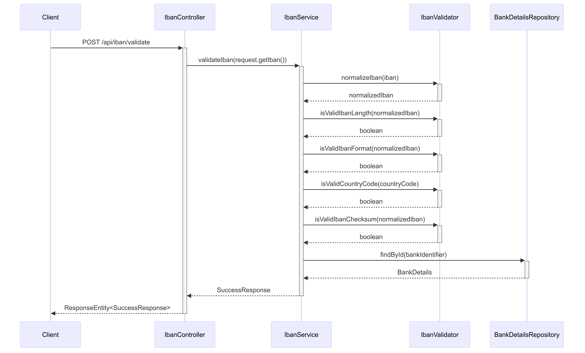
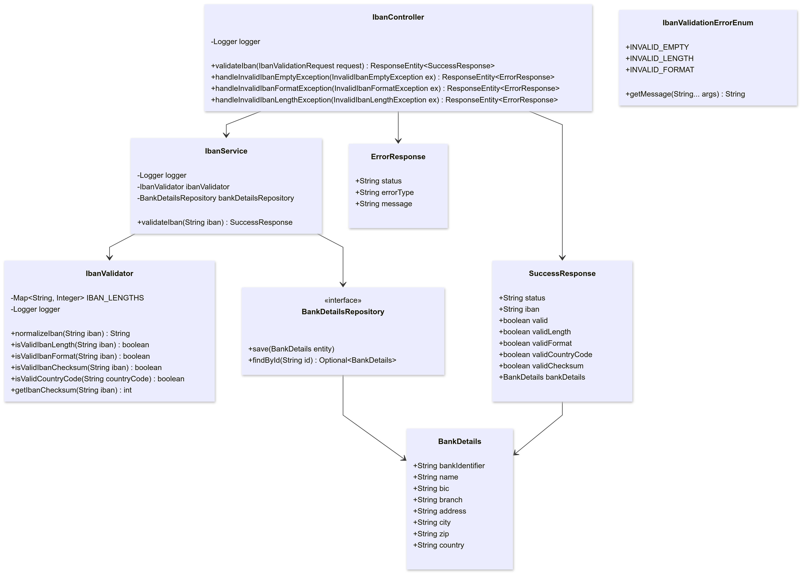
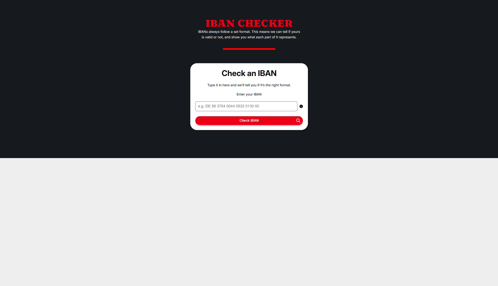
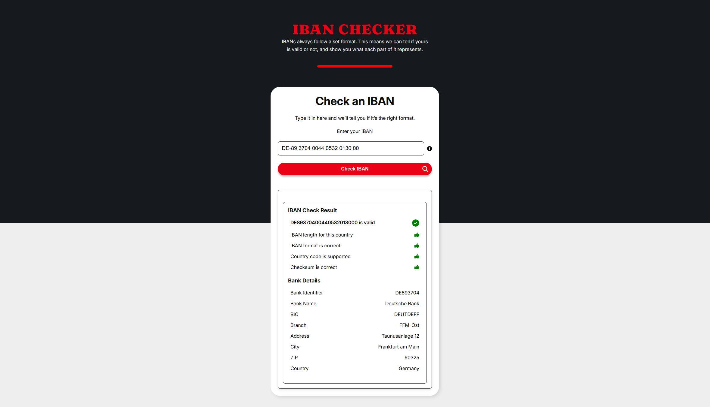
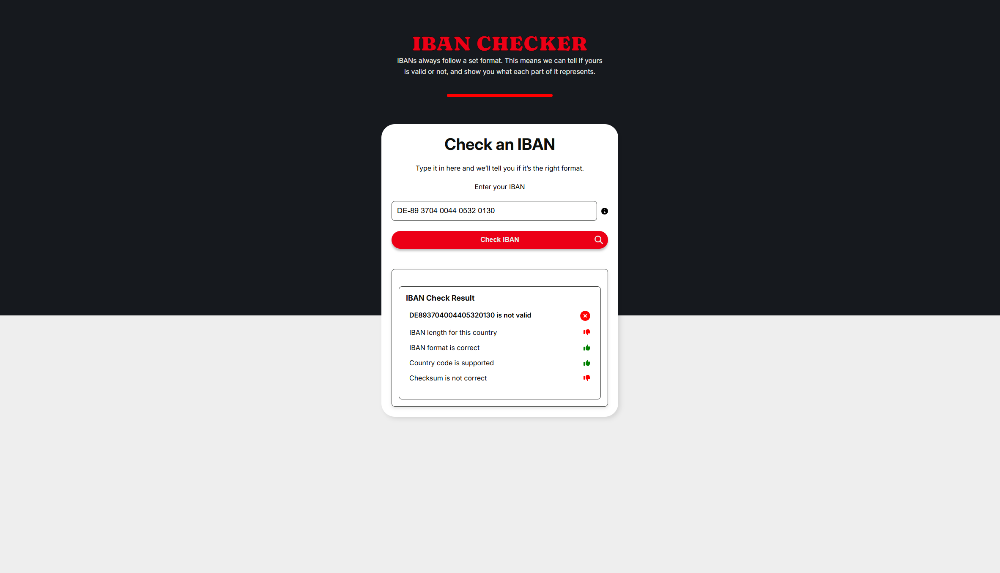
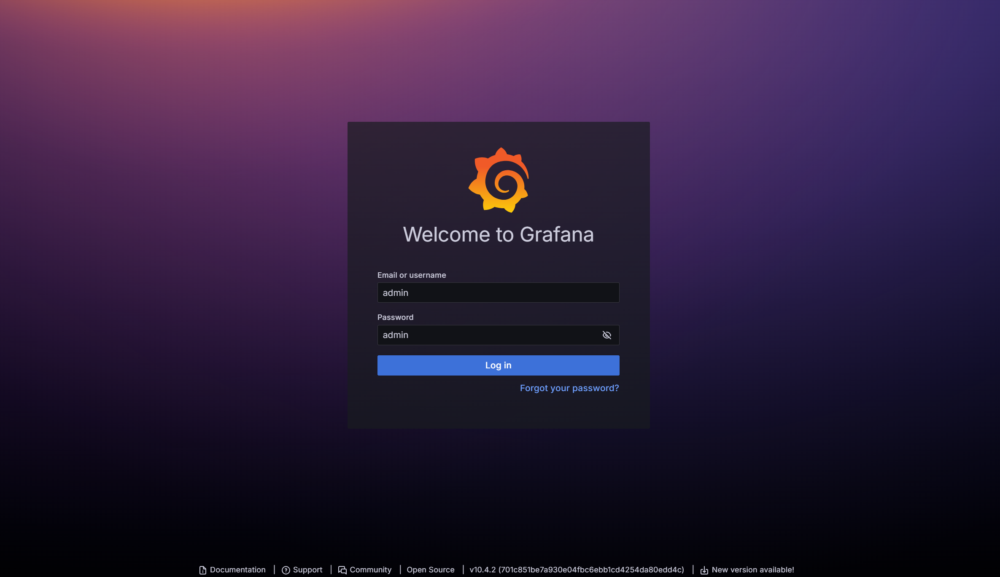
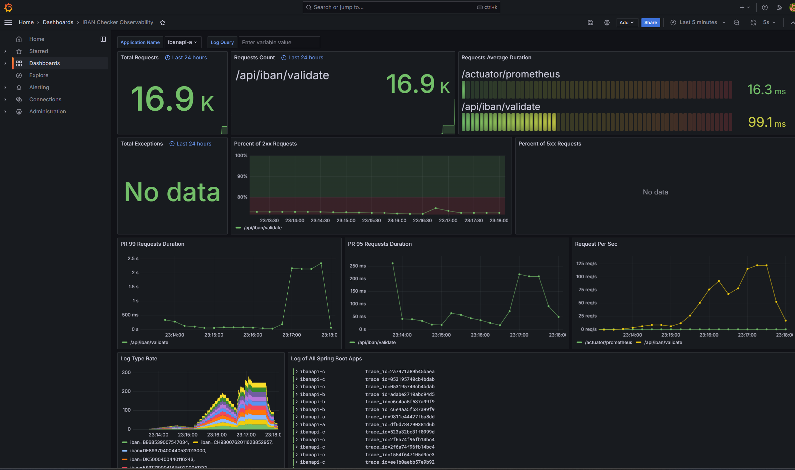
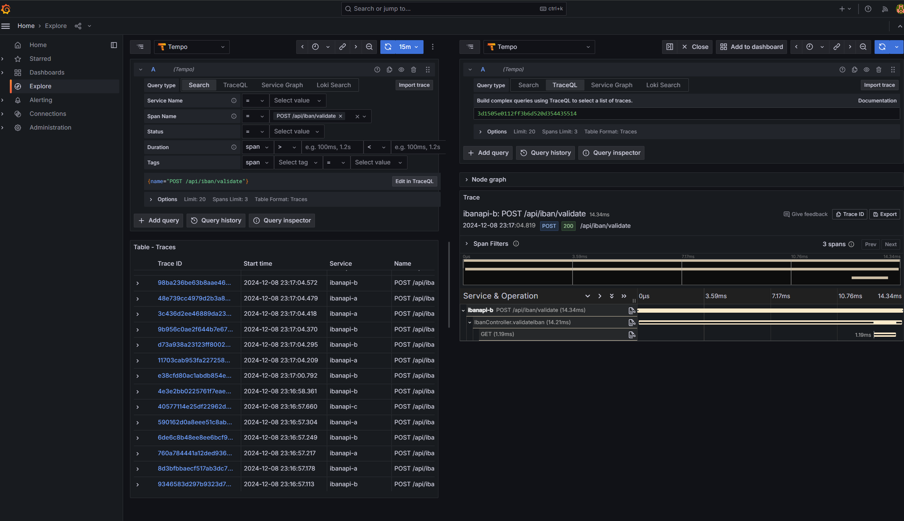

# IBAN Checker

**IBAN Checker** is a microservices-based application designed to validate International Bank Account Numbers (IBANs). It leverages a modern technology stack, integrating a **React.js** frontend, **Spring Boot** backend services, **PostgreSQL** for persistent storage, **Redis** for caching, and a robust observability setup with **Prometheus**, **Grafana**, **Loki**, and **Tempo**.

This project demonstrates a complete end-to-end pipeline: from handling user input on the frontend to validating IBANs on the backend and visualizing metrics, logs, and traces in a unified observability dashboard.

---

## Table of Contents

1. [Overview](#overview)  
   1.1. [System Design](#system-design)  
   1.2. [Sequence Diagram](#sequence-diagram)  
   1.3. [Class Diagram](#class-diagram)

2. [Architecture & Components](#architecture--components)  
   2.1. [Frontend (React.js)](#frontend-reactjs)  
   2.2. [Backend (Spring Boot)](#backend-spring-boot)  
   2.3. [Database (PostgreSQL)](#database-postgresql)  
   2.4. [Caching (Redis)](#caching-redis)  
   2.5. [Load Balancing & Reverse Proxy (Nginx)](#load-balancing--reverse-proxy-nginx)
3. [Deployment & Installation](#deployment--installation)  
   3.1. [Deployment](#deployment)  
   3.2. [Prerequisites (Optional)](#prerequisites-optional)  
   3.3. [Setup Instructions (Optional)](#setup-instructions-optional)  
   3.4. [Running the Application](#running-the-application)  
   3.5. [Load Test](#load-testing)  
   3.6. [Cleanup](#cleanup)

4. [Demo Frontend](#demo-frontend)

5. [Observability](#observability)

6. [Demo Grafana](#demo-grafana)

---

## Overview

The IBAN Checker system is composed of multiple microservices behind an Nginx reverse proxy. Users interact with a React.js frontend that communicates with backend Spring Boot services. Requests flow through Nginx to a set of Spring Boot microservices that validate IBANs. Data is stored in PostgreSQL and frequently accessed results are cached in Redis to reduce latency. The entire system’s health, performance, logs, and traces are monitored and visualized with Prometheus, Grafana, Loki, and Tempo.

### System Design

Below is a high-level architecture diagram showing the interaction between different components:


### Sequence Diagram

The sequence diagram illustrates the request flow from the user (frontend) to the backend microservices through Nginx, and how the IBAN validation logic is processed:



### Class Diagram

The class diagram provides a conceptual view of the backend code structure, including entities, services, repositories, and controllers:



---

## Architecture & Components

### Frontend (React.js)

- **Key Features:**
  - Provides a user interface to enter and validate IBANs.
  - Displays results (valid/invalid) and interactive forms.
  - Communicates with the backend via RESTful APIs.

### Backend (Spring Boot)

- **Key Features:**
  - Multiple Spring Boot services (e.g., `ibanapi-a`, `ibanapi-b`, `ibanapi-c`) handle IBAN validation logic.
  - Includes Spring Boot Actuator endpoints for health checks and metrics.
  - Implements OpenTelemetry instrumentation for distributed tracing.

### Database (PostgreSQL)

- **Key Features:**
  - Stores bank details based on the bank identifier.

### Caching (Redis)

- **Key Features:**
  - Caches validated IBAN results to improve

### Load Balancing & Reverse Proxy (Nginx)

- **Key Features:**
  - Acts as a reverse proxy to route incoming requests to the appropriate Spring Boot microservice.
  - Improves system scalability.

### Observability Stack (Prometheus, Grafana, Loki, Tempo)

- **Prometheus:** Collects metrics from services and system components.
- **Grafana:** Visualizes metrics, logs, and traces; provides dashboards and alerting.
- **Loki:** Centralized logging solution for aggregating logs from all services.
- **Tempo:** Provides distributed tracing, allowing you to track requests across service boundaries.

---

## Deployment & Installation

### Deployment

**Frontend React:**

- http://172.105.69.35

**Backend Spring Boot:**

- http://172.105.69.35:8888/docs # Nginx
- http://172.105.69.35:8080/docs # Server a
- http://172.105.69.35:8081/docs # Server b
- http://172.105.69.35:8082/docs # Server c

**Observability Grafana, Loki, Tempo:**

- http://172.105.69.35:3000  
  Username: `admin`  
  Password: `admin`

### Prerequisites (Optional)

- **Docker & Docker Compose:**  
  Install Docker and Docker Compose on your system.
- **k6 (optional):**  
  For load testing, install [k6](https://k6.io/).

### Setup Instructions (Optional)

1. **Install Docker:**  
   Refer to the [Docker website](https://docs.docker.com/get-docker/) for installation steps.

2. **Install Docker Compose:**  
   Refer to the [Docker Compose website](https://docs.docker.com/compose/install/) for installation steps.

3. **Install Loki Docker Driver:**

   ```bash
   sudo docker plugin install grafana/loki-docker-driver:2.9.2 --alias loki --grant-all-permissions
   ```

4. Start all services with docker-compose

   ```bash
   sudo docker-compose up --build
   ```

### Load Testing

5. Send requests with **curl** to the Nginx to Spring Boot REST API

   ```bash
   bash request-script.sh
   ```

6. Load test with 100 virtual users for a 60 seconds session using [k6](https://k6.io/):

   a. Install k6

   Follow the instructions on the [k6 website](https://k6.io/docs/getting-started/installation/) to install k6 for your operating system.

   b. Run the load test

   ```bash
   k6 run --vus 100 --duration 60s load_test.js
   ```

   Or send requests manually from applications' Swagger UI:

   - nginx: [http://localhost:80/docs](http://localhost:80/docs)
   - ibanapi-a: [http://localhost:8080/docs](http://localhost:8080/docs)
   - ibanapi-b: [http://localhost:8081/docs](http://localhost:8081/docs)
   - ibanapi-c: [http://localhost:8082/docs](http://localhost:8082/docs)

7. Check predefined dashboard `IBAN Checker Observability` on Grafana [http://localhost:4000/](http://localhost:4000/) and login with default account `admin` and password `admin`

### Cleanup

8. Clean Resources

   ```bash
   sudo docker-compose down
   ```

## Demo Frontend

### Start page

The application homepage provides an interface for entering and validating IBANs.



### Enter Valid IBAN

When a valid IBAN is entered, the application displays a success message with the bank details.


### Enter Invalid IBAN

When an invalid IBAN is entered, the application displays an not valid message with the reasons.



## Observability

Observe the Spring Boot application with three pillars of observability on Grafana:

- Traces with Tempo and OpenTelemetry Instrumentation for Java
- Metrics with Prometheus, Spring Boot Actuator, and Micrometer
- Logs with Loki and Logback


## Demo Grafana

### Sign In in Grafana as Admin

Log in to Grafana using the default admin credentials.



### Observability Dashboard

View the metrics, logs, and traces for the application in the observability dashboard.



### Request Tracing with Tempo

Trace requests across service boundaries to troubleshoot issues or optimize performance.


