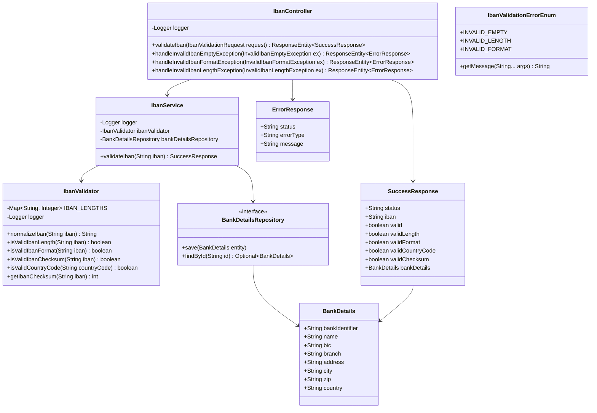

```mermaid

classDiagram
    class IbanValidator {
        -Map~String, Integer~ IBAN_LENGTHS
        -Logger logger
        +normalizeIban(String iban) String
        +isValidIbanLength(String iban) boolean
        +isValidIbanFormat(String iban) boolean
        +isValidIbanChecksum(String iban) boolean
        +isValidCountryCode(String countryCode) boolean
        +getIbanChecksum(String iban) int
    }
    class IbanService {
        -Logger logger
        -IbanValidator ibanValidator
        -BankDetailsRepository bankDetailsRepository
        +validateIban(String iban) SuccessResponse
    }
    class IbanController {
        -Logger logger
        +validateIban(IbanValidationRequest request) ResponseEntity~SuccessResponse~
        +handleInvalidIbanEmptyException(InvalidIbanEmptyException ex) ResponseEntity~ErrorResponse~
        +handleInvalidIbanFormatException(InvalidIbanFormatException ex) ResponseEntity~ErrorResponse~
        +handleInvalidIbanLengthException(InvalidIbanLengthException ex) ResponseEntity~ErrorResponse~
    }
    class BankDetailsRepository {
        <<interface>>
        +save(BankDetails entity)
        +findById(String id) Optional~BankDetails~
    }
    class BankDetails {
        +String bankIdentifier
        +String name
        +String bic
        +String branch
        +String address
        +String city
        +String zip
        +String country
    }
    class SuccessResponse {
        +String status
        +String iban
        +boolean valid
        +boolean validLength
        +boolean validFormat
        +boolean validCountryCode
        +boolean validChecksum
        +BankDetails bankDetails
    }
    class ErrorResponse {
        +String status
        +String errorType
        +String message
    }
    class IbanValidationErrorEnum {
        +INVALID_EMPTY
        +INVALID_LENGTH
        +INVALID_FORMAT
        +getMessage(String... args) String
    }
    IbanService --> IbanValidator
    IbanService --> BankDetailsRepository
    IbanController --> IbanService
    IbanController --> SuccessResponse
    IbanController --> ErrorResponse
    BankDetailsRepository --> BankDetails
    SuccessResponse --> BankDetails

```
