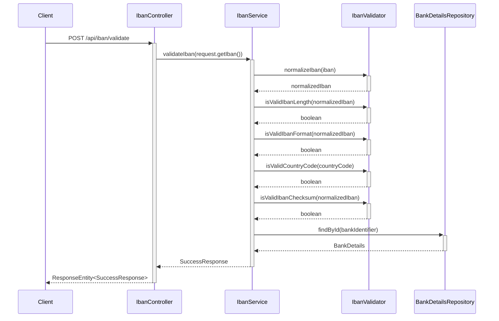

```mermaid
sequenceDiagram
    participant Client
    participant IbanController
    participant IbanService
    participant IbanValidator
    participant BankDetailsRepository
    Client->>+IbanController: POST /api/iban/validate
    IbanController->>+IbanService: validateIban(request.getIban())
    IbanService->>+IbanValidator: normalizeIban(iban)
    IbanValidator-->>-IbanService: normalizedIban
    IbanService->>+IbanValidator: isValidIbanLength(normalizedIban)
    IbanValidator-->>-IbanService: boolean
    IbanService->>+IbanValidator: isValidIbanFormat(normalizedIban)
    IbanValidator-->>-IbanService: boolean
    IbanService->>+IbanValidator: isValidCountryCode(countryCode)
    IbanValidator-->>-IbanService: boolean
    IbanService->>+IbanValidator: isValidIbanChecksum(normalizedIban)
    IbanValidator-->>-IbanService: boolean
    IbanService->>+BankDetailsRepository: findById(bankIdentifier)
    BankDetailsRepository-->>-IbanService: BankDetails
    IbanService-->>-IbanController: SuccessResponse
    IbanController-->>-Client: ResponseEntity<SuccessResponse>
```
