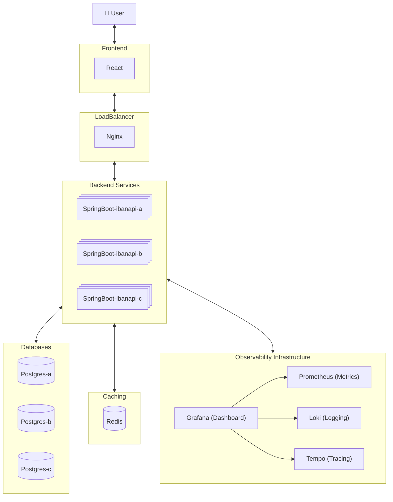

```mermaid
---
config:
  look: classic
  theme: default
  layout: dagre
---
flowchart TD
 subgraph Frontend["Frontend"]
        React["React"]
  end
 subgraph LoadBalancer["LoadBalancer"]
        Nginx["Nginx"]
  end
 subgraph BackendServices["Backend Services"]
        Server1["SpringBoot-ibanapi-a"]
        Server2["SpringBoot-ibanapi-b"]
        Server3["SpringBoot-ibanapi-c"]
        Server1@{ shape: procs}
        Server2@{ shape: procs}
        Server3@{ shape: procs}
  end
 subgraph Databases["Databases"]
        DB1[("Postgres-a")]
        DB2[("Postgres-b")]
        DB3[("Postgres-c")]
  end
 subgraph Caching["Caching"]
        Redis[("Redis")]
  end
 subgraph Observability["Observability Infrastructure"]
        Prometheus["Prometheus (Metrics)"]
        Grafana["Grafana (Dashboard)"]
        Loki["Loki (Logging)"]
        Tempo["Tempo (Tracing)"]
  end
    User["👤 User"] <--> Frontend
    Frontend <--> LoadBalancer
    LoadBalancer <--> BackendServices
    BackendServices <--> Databases & Caching & Observability
    Grafana --> Prometheus & Loki & Tempo


```
